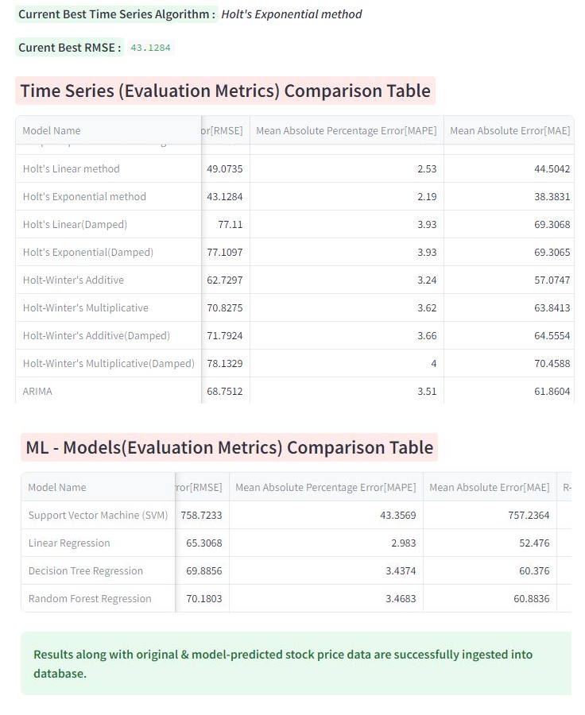

# Stock Price Prediction Web App

Welcome to the **Stock Price Prediction Web App**! This project showcases a comprehensive data pipeline and modeling system for forecasting stock prices. The application is built with a focus on scalability, performance, and user experience. Designed to highlight skills in data engineering, data analysis, machine learning, and web development, this project also features seamless data visualization and an interactive Streamlit web application. Try out, explore and enjoy the web app! [Click Here](https://stock-price-prediction-nigam-rahul.streamlit.app).

---

## Table of Contents

1. [Overview](#overview)
2. [Features](#features)
3. [Workflow Architecture](#workflow-architecture)
4. [Tools and Technologies Used](#tools-and-technologies-used)
5. [Modules Breakdown](#modules-breakdown)
6. [Results and Metrics](#results-and-metrics)
7. [Deployment](#deployment)
8. [Conclusion and Future Scope](#conclusion-and-future-scope)
9. [Bibliography](#bibliography)
---

## Overview

**<u>This project enables users to</u>:**

- Fetch live stock data from Yahoo Finance and store it securely in MongoDB Atlas database.
- Analyze past trends and perform exploratory data analysis (EDA).
- Apply time series techniques and machine learning models to forecast future stock prices.
- Compare various models' predictions, view evaluation metrics, and obtain impactful findings through an intuitive web interface.

---

## Features

- <u>**Dynamic Data Collection**</u>: 

   BeautifulSoup-powered web scraping to fetch stock price data and company information in real-time. yfinance api is used fot historical stock data ingestion

- <u>**Database Management**</u> : 

   Robust data storage and retrieval using MongoDB Atlas.

- <u>**Comprehensive EDA**</u> : 

   Analyzes past trends, including maximum and minimum price visualizations.

- <u>**Time Series Analysis**</u> : 

   Using statsmodels library, implements various smoothing methods including Simple Smoothing and advance Exponential Smoothing. Also utilizes ARIMA model. Exponential Smoothing (AutoETS) is performed from sktime library.

- <u>**Machine Learning Algorithms**</u> : 

   Support for Linear Regression, SVM, Decision Trees, and Random Forest models.

- <u>**Evaluation Metrics**</u> : 

   Compares models using RMSE, MAPE, and MAE.

- <u>**Results Persistence**</u> :

   Predicted vs. actual stock prices and evaluation metrics are stored in MongoDB database.

- <u>**User-Friendly Interface**</u> :
   
   A beautifully designed and interactive Streamlit web app.

- <u>**Future Forecasts**</u> :

    Empower users with accurate and customizable stock price forecast for  upcoming days.

---

## Workflow Architecture

Below is the architecture of the project, demonstrating data flow, model execution, and results visualization.

**<u>Workflow</u>:**

1. Fetching stock data from Yahoo Finance.
2. Ingesting scraped data into MongoDB Atlas.
3. Performing Exploratory Data Analysis.
4. Implementing time series analysis models (Smoothing, ARIMA, AutoETS).
5. Training machine learning models.
6. Getting forecast for selected number of future days.
7. Evaluating model performance (RMSE, MAPE, MAE).
8. Storing Original Vs. predicted stock price along with results in MongoDB.
9. Visualizing data and predictions via Streamlit web app.
10. Displaying stored evaluation metrics data of all the models to compare model
   performance.

---

## Tools and Technologies Used

| Technology    | Usage                                                      |
| ------------- | -----------------------------------------------------------|
| Python        | Backend development and model implementation.              |
| MongoDB Atlas | Cloud-based scalable NoSQL database storage.               |
| Streamlit     | Interactive user interface for web application development.|
| BeautifulSoup | Web scraping (data fetching from Yahoo Finance).           |
| statsmodels   | Time series modeling (Smoothing, ARIMA).                   |
| sktime        | Time series analysis (AutoETS).                            |
| scikit-learn  | Machine learning models.                                   |
| Pymongo       | MongoDB Atlas integration using python.                    |
| yfinance      | Historical stock price data from yahoo finance website.    |

---

## Modules Breakdown

1. **Data Fetching & Database Initialization**

   - Fetches stock data from Yahoo Finance using BeautifulSoup.
   - Stores raw  data in MongoDB Atlas.
   
   
   
   
   
2. **EDA (Exploratory Data Analysis)**

   - Analyzes historical stock price trends.
   - Computes key statistics and visualizes max/min prices.
   
   
   
   
   
   
   

3. **Time Series Analysis**
   - Forecasts of stock price for selected number of days.
   - Implements various Smoothing techniques (statsmodels).
   - Also utilizes  ARIMA (statsmodels) and AutoETS (sktime).

   
   
   
   
   
   

4. **Machine Learning**

   - Predicts stock prices using:
     - Linear Regression
     - Support Vector Machines (SVM)
     - Decision Trees
     - Random Forest
   - Evaluation metrics: RMSE, MAPE, MAE.
   

---

## Results and Metrics

**Evaluation Metrics:**

- RMSE (Root Mean Square Error)
- MAPE (Mean Absolute Percentage Error)
- MAE (Mean Absolute Error)
- R-squared Score

**<u>Results are stored in MongoDB for</u>:**

1. **Predicted vs. Actual Prices:** Helps compare forecasts.
2. **Evaluation Metrics:** Identifies the most accurate model.

---

## Deployment

The web app is deployed on [Streamlit Sharing](https://streamlit.io/sharing).

---

## Conclusion and Future Scope

**<u>Based on the evaluation metrics calculated</u>:**

- Leveraged regression and tree-based models, reducing ***Mean Absolute Percentage Error (MAPE)*** significantly to **2.19%** using ***Holt's Exponential method*** compared to 43.35% in SVM regression.
- Enhanced model performance, achieving up to **94%** improvement in ***Root Mean Squared Error (RMSE)*** by transitioning from SVM (758.72) to Holt's Exponential method (43.13).
- Integrated advanced exponential smoothing techniques like ***Holt-Winter's Additive***, further refining accuracy with ***Mean Absolute Error (MAE)*** reduced to **38.38** from 757.23 in SVM.
- Delivered robust predictive solutions, achieving substantial R-squared score gains, showcasing expertise in forecasting and regression modeling approaches.

The Stock Price Prediction Web App demonstrates the integration of data engineering, machine learning, and user-centric design. Its robust architecture and reliable predictions offer significant utility for forecasting tasks and highlight practical implementation skills.

The changes in the stock market are not always be in a regular pattern or not always follow the continuous cycle. Based on the companies and sectors, the existence of the trends and the period of their existence will differ. The analysis of this type of cycles and trends can offer a more profit to the investors.

In future work, I would like to add more complex models to improve accuracy of predicted stock price. For better accuracy, model can be trained with more varied and detailed data. Also, other strategies along with proposed ones can be used to create a new hybrid model.

---

## Bibliography

-  Stock Market Prediction Using Machine Learning (Research Gate Conference Paper) December 2018 DOI:10.1109/ICSCCC.2018.8703332 Conference: First Inter-national Conference on Secure Cyber Computing and Communication At: National Institute of Technology (NIT), Jalandhar.
- Machine Learning Strategies for Time Series Forecasting
 https://doi.org/10.1007/978-3-642-36318-4_3 
Journal: Business Intelligence Lecture Notes in Business Information Processing, 2013, p. 62-77
Publisher: Springer Berlin Heidelberg
Authors: Gianluca Bontempi, Souhaib Ben Taieb, Yann-Aël Le Borgne
- Forecasting: Principles and Practice (3rd ed) Rob Hyndman https://otexts.com/fpp3/
- Stock Market Price Prediction and Analysis International Journal of Engineering Research & Technology (IJERT) ISSN: 2278-0181
- https://www.researchgate.net/publication/331279199_Stock_Market_Prediction_Using_Machine_Learning
- https://www.mongodb.com/docs
- https://docs.streamlit.io
